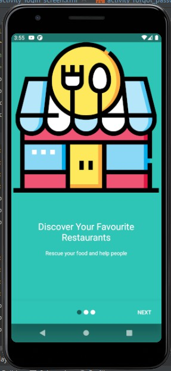
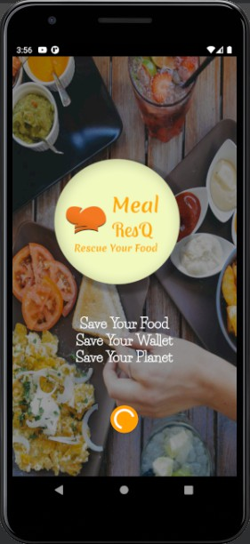
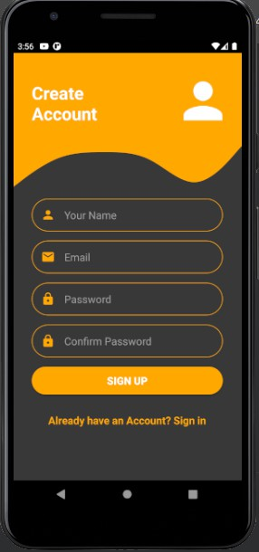

# MealResQ
RPL's project
  

Meal Rescue, merupakan aplikasi berbasis android yang 
memberikan opsi untuk save your food and save 
your budget. Kami menyediakan opsi untuk 
para masyarakat yang ingin mengurangi 
food waste dengan menjual makanan berlebih 
di marketplace kami serta orang lain dapat 
membantu Bumi dengan membeli makanan 
berlebih tersebut.
 
 
Meal Rescue memberikan opsi untuk para masyarakat yang ingin mengurangi foodwaste untuk menjual makanan berlebih dengan harga yang lebih murah di Marketplace kami. Pengguna lain dapat membantu Bumi dengan membeli makanan berlebih tersebut sehingga tidak ada makanan yang terbuang sia-sia. Meal Rescue ini menjadi win-win solution untuk para pedagang dan juga para pembeli. 
Bagaimana cara Meal Rescue bekerja?
 
•	Cari penjual makanan dan pesan melalui aplikasi.
 
•	Selamatkan makanan yang ada di toko pada waktu yang ditentukan.
 
•	Nikmati makanan sambil mengetahui bahwa Anda baru saja mengurangi food waste serta membantu Planet Bumi.
Aplikasi ini ditujukan kepada siapapun yang ingin membantu mengurangi foodwaste dengan cara membeli makanan menggunakan aplikasi kami. Kami juga menujukan aplikasi kami kepada Online Food Order Services , seperti Grab dan Gojek untuk menjadi partnership kami sebagai sistem pengantaran kami.
 
 
Meal Rescue merupakan sebuah aplikasi diciptakan atas dasar kekhawatiran tentang kondisi foodwaste yang ada di Indonesia. Menurut data dari Economist Intelligence Unit, Indonesia merupakan negara penghasil foodwaste terbesar kedua di Dunia dengan rata-rata 300 Kilogram makanan dibuang per orang setiap tahunnya.

<table>
  <tr>
    <td>  </td>
     <td>  </td>
     <td>  </td>
  </tr>
  <tr>
    <td></td>
    <td></td>
    <td></td>
  </tr>
 </table>

  
Crowd prediction using prophet time series algorithm
<table>
  <tr>
    <td>  </td>
     <td>  </td>
     <td>  </td>
  </tr>
  <tr>
    <td></td>
    <td></td>
    <td></td>
  </tr>
 </table>
     <td>  </td>
     <td>  </td>
 Untuk meng-clone dan menggunakan aplikasi kami, pertama anda dapat mendownload source code kami. IDE 
 yang disarankan adalah Android Studio. Setelah source code dalam zip didownload, zip dapat diextract. Melalui Android Studio, anda bisa memilih open project di bagian menu File, dan pilih folder source code yang sudah di extract. Lalu pilih MealResQ Master dengan gambar android dan buka file tersebut. Setelah itu anda perlu melakukan sync gradle agar library yang dibutuhkan dapat di install di perangkat anda. Setelah itu anda perlu perangkat sebagai emulator, bisa menggunakan handphone android yang sudah dalam developer mode, ataupun
